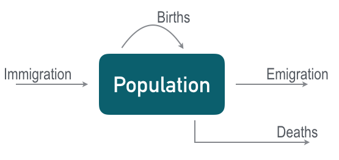

```{r, echo=FALSE, message=FALSE}
library(shiny)
library(shinyapps)
library(png)
library(rmarkdown)
library(ggplot2)
library(ggthemes)
#devtools::install_github("EcoEvoEducation/EcoEvoApps")

```

### Introduction
When a species is of conservation concern, we are interested in whether populations can persist in the long term. In order to examine population viabiliy, we can use demographic information to model population dynamics.

Usually we start with the idea that in any population, the number of individuals at any particular time is governed by the initial population size, $N_0$, and the number of births, deaths, immigrations, and emigarations that occur.



In the simplest approach, we can use a disctrete-time model and demographic information to predict the expected size of a population over time.

**Assumption:** Here we consider a closed population, where there are no immigarants joining the population or emmigrants leaving the population, only births and deaths affect the number of inidividuals in the population.

For simplicity, we don't explicitly address deaths, and instead we examine suvivorship, $S$, or the per capita probability of suriving in a particular timestep. $S$ is still calculated with the per capita death rate in mind:

$$S=1-d$$

Then population size in each timestep is a function of the population size at the time before ($N_t$), survivorship ($S$), and the per capita birth rate ($b$) as shown in the equation below.

$$N_t+1=N_t [S+b]$$

To program these dynamics, we start by considering a population with an initial population size of 100, a survivorship rate of $S=0.8$, and a birthrate of $b=0.2$:

```{r, echo=FALSE}
my_theme <- theme_bw()+
  theme(panel.grid.major.x = element_blank(), 
        panel.grid.minor.x = element_blank(),
        panel.grid.minor.y = element_blank(),
        panel.grid.major.y = element_line(linetype="dotted", color=NA),
        panel.background = element_rect(fill = "#EFEFEF"),
        axis.text=element_text(size=16, color="grey35", family = "Arial Narrow"),
        axis.title=element_text(size=18, family = "Arial Narrow", face = "bold"),
        panel.border = element_blank(),
        axis.line.x = element_line(color="black"),
        axis.line.y = element_line(color="black"))
inputPanel(
  sliderInput("N0", label = "Initial Population size:",
              min = 10, max = 100, value = 50, step = 10),
  
  sliderInput("S", label = "Survivorship:",
              min = 0.2, max = 0.9, value = .8, step = 0.1),
  
  sliderInput("b", label = "Birth rate:",
              min = 0.2, max = 0.9, value = .2, step = 0.1)
)

renderPlot({
  nSteps<-50
  time<-seq(from=1, to=nSteps, by=1)
  
  Nvec<-c(input$N0, rep(NA, times=nSteps-1))
  
  for (i in 2:nSteps){
    Nvec[i]<-Nvec[i-1]*(input$S+input$b)
    }
  
#   plot(Nvec~time, ylab="Number of individuals (N)", xlab="Time (t)",
#        ylim=c(input$N0,max(Nvec)), type="o")
  plot_df <- data.frame(N=Nvec,Time=time)
  ggplot(plot_df, aes(x=Time, y=N))+
    geom_line(color="#BB5635")+
    geom_point(color="#BB5635", size=3)+
    ylab("Population size (N)")+
    my_theme
    
})
```

As you can see, smaller populations go extinct more quickly, and take more time to grow than large populations with the same survivorship and birth rates. Futhermore, in order for a population to remain viable in the long term, survivorship and births must be balanced so that $S+b=1$. The term  $\lambda$  is often used to summarize the sum of per capita survivorship and births.

## $$\lambda= S+b$$

So, instead of changing s and b one at a time, we can use $\lambda$ in our model to summarize the dynamics of the population:

```{r, echo=FALSE}
inputPanel(
  sliderInput("N02", label = "Initial Population size:",
              min = 10, max = 100, value = 50, step = 10),
  
  sliderInput("lambda", label = "Population Growth Rate:",
              min = 0.2, max = 1.8, value = 1, step = 0.1)

)

renderPlot({
  nSteps<-50
  time<-seq(from=1, to=nSteps, by=1)
  
  Nvec<-c(input$N02, rep(NA, times=nSteps-1))
  
  for (i in 2:nSteps){
    Nvec[i]<-Nvec[i-1]*(input$lambda)
    }
  
  plot_df <- data.frame(N=Nvec,Time=time)
  ggplot(plot_df, aes(x=Time, y=N))+
    geom_line(color="#BB5635")+
    geom_point(color="#BB5635", size=3)+
    ylab("Population size (N)")+
    my_theme
    
})
```

You can program these plots yourself in R using the code below:

```{r, echo=TRUE, fig.show='hide'}
  
  N0     <- 50    # The intitial population size
  nSteps <- 50    # The number of time steps
  lambda <- 1     # The population growth rate, lambda
  Nvec   <- c(N0, rep(NA, times=nSteps-1))  # Create an open vector for data
  
  #Run a loop that considers each time step (t) as a function of the time step before it (t-1) and lambda
  for (t in 2:nSteps){
    Nvec[t] <- Nvec[t-1]*(lambda)
  }
  
  time    <- seq(from=1, to=nSteps, by=1)  #Create a vector of time steps for plotting
  plot_df <- data.frame(N=Nvec,Time=time)
  
  require(ggplot2)
  require(ggthemes)
  ggplot(plot_df, aes(x=Time, y=N))+
    geom_line(color="#BB5635")+
    geom_point(color="#BB5635", size=3)+
    ylab("Population size (N)")+
    my_theme

```

