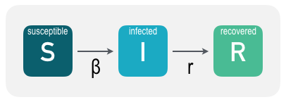

```{r, echo=FALSE, message=FALSE}
library(shiny)
library(shinyapps)
#devtools::install_github("EcoEvoEducation/EcoEvoApps")
```
### Introduction
Modeling the establishment and spread of pathogens, which cause and carry infectious diseases, is a cornerstone of disease ecology and epidemiology. The simplest, yet still very effective, approach to modeling disease transmission is to separate a population into compartments that represent the health status of portions of the population. Perhaps the most popular *compartmental model* is the **SIR** model that divides the focal population into three compartments: **S**usceptible, **I**nfected, and **R**ecovered ([see here for Wikipedia description](http://en.wikipedia.org/wiki/Compartmental_models_in_epidemiology#The_SIR_model)).

The basic idea is that each compartment contains the number of individuals from the population that are in that particular health state. So, the sum of the states must equal the total population size ($N$): $N = S+I+R$. These states are dynamic through time ($t$) and so at each time step individuals transition from one state to another based on given rates. In the SIR model, we assume that susceptibles can transition to the infected state at rate $\beta$, and that infected individuals can transition to the recovered state at rate $r$ as in the figure below:



So putting this all together, the mathematical representation of the SIR dynamical (varies through time) model is:

$$
\begin{align}
\frac{dS}{dt} &= -\beta S(t) I(t) \\
\frac{dI}{dt} &= \beta S(t) I(t) - rI(t) \\
\frac{dR}{dt} &= rI(t)
\end{align}
$$

where $\beta$, the disease transmission rate, is a function of disease infectiousness ($\eta$) and individual contact rate ($\tau$): $\beta = \eta \times \tau$. **Note that in this model we assume that once an individual recovers from infection, that individual is immune.** How would the figure above change if recovered individuals could still become infected?

To keep everything clear, here is a table of model states and parameters.

| Parameter | Definition |
|---|---|
| $S$ | The number of susceptible (yet-to-be infected) individuals in the population | 
| $I$ | The number of infected individuals in the population |
| $R$ | The number of recovered indviduals in the population (recovered and now immune) |
| $\beta$ | Transition rate from susceptible to infected; function of disease infectiousness and individual contact rate |
| $r$ | Recovery rate |
| $\eta$ | Disease infectiousness; the probability that contact results in infection |
| $\tau$ | Individual contact rate; the rate at which individuals come into contact |


### Play with the model parameters

```{r, echo=FALSE}
library(deSolve)
library(ggplot2)
library(reshape2)
library(EcoEvoApps)
shinyAppDir(
  system.file("examples/SIR", package="EcoEvoApps"),
  options=list(
    width="100%", height=550
  )
)
```


