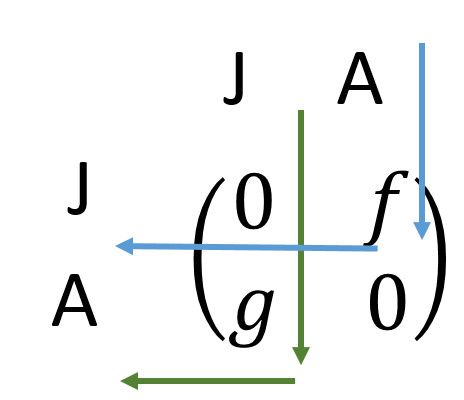

```{r, echo=FALSE, message=FALSE}
library(shiny)
library(shinyapps)
library(png)
library(rmarkdown)
#devtools::install_github("EcoEvoEducation/EcoEvoApps")

```

### Introduction
Most populations in nature are not homogenous because individuals differ from one another in size or age. Since these characteristics can affect rates of survival, growth, and reproduction, we often want to account for these effects.

Take for example, a system in which indviduals are either adults, $A$, or juveniles, $J$. For simplictiy, we **assume** that individuals may only persist as adults or juveniles for one timestep. 

<div align="center"></div>

In each timestep, the number of juveniles, $J$, is a function of the number of adults in the prior timestep, $A$, and their reproductive rate, $f$. 

$J_{t+1}=A_t*f$

Similarly, the number of adults in each timestep, $A$, is a function of the number of juveniles in the last timestep, $J$, that became adults at the per capita growth rate, $g$.

$A_{t+1}=J_t*g$

If you remember from your algebra classes, this problem can be represented by a system of equations because information from one equation can be used to solve the other, and vice-versa. Alternatively, we can use **matrix models** to summarize the dynamics of this population.

To use a matrix model, we combine the information into rows and columns that represent transitions.

$\left( \begin{array}{c}
J \\
A \end{array} \right) = 
 \left( \begin{array}{cc}
0 & f \\
g & 0 \end{array} \right)$

In this format, each transition is accounted for: the upper left quadrant of the matrix represents reproduction (Adults to Juveniles), the lower right represents growth (Juveniles to Adults), and the other two are set to zero, becasue adults may not stay adults and juveniles may not stay juveniles.

<div align="center"></div>

Matricies are always read from the top and to the left in this way (see figure 2), but can be expanded to include more than two stages. 


```{r, echo=FALSE}
inputPanel(
  sliderInput("N01", label = "Initial Population size:",
              min = 50, max = 500, value = 50, step = 50),
  
  sliderInput("lambda", label = "Population Growth Rate:",
              min = -.2, max = 3.2, value = 1.3, step = 0.2),
  
  sliderInput("K", label = "Carrying capacity:",
              min = 50, max = 500, value = 500, step = 50)
)

renderPlot({
  nSteps<-50
  time<-seq(from=1, to=nSteps, by=1)
  
  Nvec<-c(input$N01, rep(NA, times=nSteps-1))
  
  for (i in 2:nSteps){
    Nvec[i]<-Nvec[i-1]+(input$lambda)*Nvec[i-1]*(input$K-Nvec[i-1])/input$K
    }
  
  plot(Nvec~time, ylab="Number of individuals (N)", xlab="time (t)", 
       ylim=c(0,600), type="o")
  abline(h=input$K, col="purple", lty=2)  
})
```

Notice that when the population growth rate $r$ gets large, the dynamics of the system become increasingly irregular. 

It turns out that discrete time versions of models that try to capture the effects of carrying capacities have funny properties that make them sensitive to initial population size and growth rate. This os often referred to as *deterministic chaos*.

Below, Compare two species when they have the same carrying capacity ($K=500$) and only slightly different initial conditions or growth rates.

```{r, echo=FALSE}
inputPanel(
  sliderInput("N02.1", label = "Initial Population size:",
              min = 50, max =500, value= 150 , step = 5),
  
  sliderInput("lambda.1", label = "Population Growth Rate:",
              min = -.2, max = 3.2, value = 1.1, step = 0.1),
  
  sliderInput("N02.2", label = "Initial Population size:",
              min = 50, max = 500, value = 150, step = 5),
  
  sliderInput("lambda.2", label = "Population Growth Rate:",
              min = -.2, max = 3.2, value = 1.3, step = 0.1)

)

renderPlot({
  
  nSteps<-50;
  K<-500;
  time<-seq(from=1, to=nSteps, by=1);
  
  N1vec<-c(input$N02.1, rep(NA, times=nSteps-1));
  
  for (i in 2:nSteps){
    N1vec[i]<-N1vec[i-1]+(input$lambda.1)*N1vec[i-1]*(K-N1vec[i-1])/K
    };

  N2vec<-c(input$N02.2, rep(NA, times=nSteps-1))
  
  for (i in 2:nSteps){
    N2vec[i]<-N2vec[i-1]+(input$lambda.2)*N2vec[i-1]*(K-N2vec[i-1])/K
    }
  
  plot(N1vec~time, ylab="Number of individuals (N)", xlab="time (t)",
       ylim=c(0,600), type="o")
  
  abline(h=K, col="purple", lty=2)
  
  lines(N2vec~time, col="orange")
    
})

```

When the population growth rate is high enough, the population "overshoots" the carrying capacity, and then is corrected. These cycles can be stable or unstable, and we can follow the population trajectory towards equilibrium using a cobwebb diagram, as shown below.

```{r, echo=FALSE}
inputPanel(
  sliderInput("N02", label = "Initial Population size:",
              min = 50, max = 500, value = 50, step = 50),
  
  sliderInput("lambda2", label = "Population Growth Rate:",
              min = -.2, max = 3.2, value = 2.7, step = 0.1),
  
  sliderInput("K2", label = "Carrying capacity:",
              min = 50, max = 500, value = 350, step = 50)
)

renderPlot({
  nSteps<-50
  time<-seq(from=1, to=nSteps, by=1)
  Nvec<-c(input$N02, rep(NA, times=nSteps-1))
  
  for (i in 2:nSteps){
    Nvec[i]<-Nvec[i-1]+(input$lambda2)*Nvec[i-1]*
      (input$K2-Nvec[i-1])/input$K2
    }
  
  baseVec<-seq(1:600)
  curveVec<-NA
  for (i in 1:length(baseVec)){
    curveVec[i]<-baseVec[i]+(input$lambda2)*baseVec[i]*
      (input$K2-baseVec[i])/input$K2
    }
  
  jet.colors <- colorRampPalette(c("#00007F", "blue", 
      "#007FFF", "cyan", "#7FFF7F", "yellow", "#FF7F00", "red", "#7F0000"))
  
  go<-length(Nvec)-2
  par(mfrow=c(1,2))
  
  plot(NA, ylab="Number of individuals (N)", xlab="time (t)",
       ylim=c(0,600), xlim=c(0,nSteps))
  
    for (j in 1:go) {
    segments(time[j],Nvec[j],time[j+1],Nvec[j+1], 
             col=jet.colors(nSteps)[j])
    }
  
  plot(curveVec~baseVec, ylim=c(0,600), xlim=c(0,600), ylab="N1", xlab="N2", type="l", lwd=2)
  
  for (j in 1:go) {
    arrows(Nvec[j],Nvec[j+1],Nvec[j+1],Nvec[j+1], 
             col=jet.colors(nSteps)[j], length=.25, lwd=1.3)
        arrows(Nvec[j+1],Nvec[j+1],Nvec[j+1],Nvec[j+2], 
             col=jet.colors(nSteps)[j], length=.25, lwd=1.3)
    }
  
  abline(h=input$K2, col="purple", lty=2)
  abline(v=input$K2, col="purple", lty=2)
  
})

```

You can program these dynamics for yourself in R using the code below:

```{r, echo=TRUE, fig.show='hide'}
  
  N0<-50   #The intitial population size
  nSteps<-50    #The number of time steps
  r<-1     # The population growth rate, r
  K<-500        #The carrying capacity

  Nvec<-c(N0, rep(NA, times=nSteps-1))  #Create an open vector for data
  
  #Run a loop that considers each time step (t) as a function of the time step before it (t-1) and r
  for (t in 2:nSteps){
    Nvec[t]<-Nvec[t-1]+r*Nvec[t-1]*(K-Nvec[t-1])/K
    }
  
  time<-seq(from=1, to=nSteps, by=1)  #Create a vector of time steps for plotting
  
  plot(Nvec~time, ylab="Number of individuals (N)", xlab="time (t)", 
       ylim=c(0,100), type="o")  #plot the results

```

